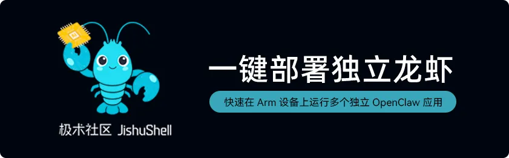

# JishuShell: 基于 AIBOX 的安全沙箱与 OpenClaw 本地运行框架

近期AI技术生态中有个耳熟能详的词：OpenClaw，也就是所谓的“龙虾”，而为了将龙虾本地化，许多平台和厂商都在投入研发相关变体和工具，其中安谋科技(Arm China)旗下的极术社区发布了JishuShell：一款能够将龙虾一键部署到本地的工具，让AI Agent更方便实现本地运行。




目前，Firefly AIBOX-3576和AIBOX-3588已成功跑通JishuShell，为龙虾本地化提供强大的硬件支持。


## JishuShell 核心功能

在众多OpenClaw变体和工具中，JishuShell作为Arm设备量身打造的AI应用基础设施，具备五大核心功能：

（1）一键部署：

与传统OpenClaw相比，JishuShell无需手动配置环境、修改配置、调接口等步骤，几分钟内就能完成部署，在本地设备上跑起来；


（2）能力集成：

扫码即可接入微信、飞书等应用软件，快捷使用各种Skills、MCP等丰富工具；


（3）安全沙箱：

基于Docker容器技术隔离Claw应用与系统环境，API Key独立管理，数据选择性授权，易于数据迁移，且安全性高，能够进入企业生产领域；


（4）支持龙虾多开：

支持在单台设备上同时运行多个龙虾实例，充分发挥硬件能力；


Web可视化统一管理：

集中管理所有AI应用的版本、配置与状态，提供网页界面配置模型、工具、参数，替代复杂的config.json使用。

---


## 快速开始

### 前置要求

- **Node.js 22+**（必需）
- **Linux**（Debian、Ubuntu）

### 安装

Shell 安装脚本：
```bash
curl -fsSL https://aijishu.com/install.sh | bash
```

NPM 安装
```bash
npm install -g jishushell
```

在浏览器中打开 `http://localhost:8090`。
