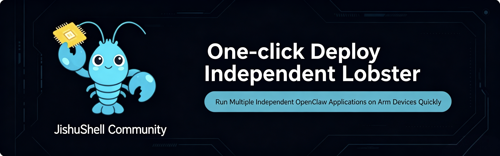
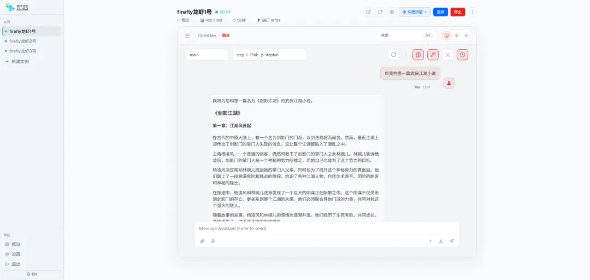

# JishuShell: A Secure Sandbox and Local Runtime Framework for OpenClaw based on AIBOX

Recently, a buzzword has been echoing through the AI ecosystem: **OpenClaw** (often referred to as "Lobster"). To bring the "Lobster" local, many platforms and vendors are investing in related variants and tools. Among them, **Jishu Community** (Arm China) has released **JishuShell**: a tool designed to deploy the Lobster locally with a single click, making it easier for AI Agents to run natively.



Currently, **Firefly AIBOX-3576** and **AIBOX-3588** have successfully run JishuShell, providing powerful hardware support for the localization of the Lobster.



## Core Features of JishuShell

Among the many OpenClaw variants and tools, JishuShell stands out as an AI application infrastructure tailored for Arm devices, featuring five core capabilities:

1.  **One-Click Deployment**
    Unlike traditional OpenClaw setups, JishuShell requires no manual environment configuration, config modifications, or API tuning. You can complete the deployment and get it running on your local device in just a few minutes.

2.  **Capability Integration**
    Scan a QR code to connect with applications like WeChat and Feishu (Lark), allowing for quick access to a wide range of tools such as Skills and MCPs.

3.  **Secure Sandbox**
    Utilizes Docker container technology to isolate Claw applications from the system environment. It features independent API Key management, selective data authorization, easy data migration, and high security, making it suitable for enterprise production environments.

4.  **Support for Multi-Instance Lobster**
    Supports running multiple Lobster instances simultaneously on a single device, fully leveraging hardware capabilities.

5.  **Unified Web-based Visual Management**
    Centrally manages versions, configurations, and statuses of all AI applications. It provides a web interface to configure models, tools, and parameters, replacing the complex usage of `config.json`.

---

## Quick Start

### Prerequisites

*   **Node.js 22+** (Required)
*   **Linux** (Debian, Ubuntu)

### Installation

**Shell Installation Script:**
```bash
curl -fsSL https://aijishu.com/install.sh | bash
```

**NPM Installation:**
```bash
npm install -g jishushell
```

Open `http://localhost:8090` in your browser.

