# [养虾指南 on Arm]Mac Mini玩转JishuShell - 基础安装配置

---

> JishuShell 是一个开源的 AI Agent 管理工具，让你在自己的设备上一键部署和管理 Agent框架（比如OpenClaw）与 AI 周边应用。本文以 Mac Mini（Apple Silicon）为例，从零开始完成 JishuShell 的安装和第一次对话。
>
> 同样的安装流程适用于所有 Arm 设备 —— 树莓派、Nvidia Jetson、RK3588、此芯 P1 等，只是 macOS 特有的 Xcode CLT 和 Homebrew 步骤可以跳过。

---

## 一、一键安装

打开终端，粘贴以下命令并回车：

```bash
curl -fsSL https://aijishu.com/install.sh | bash
```

安装脚本会自动检测你的系统环境，选择合适的组件进行安装。

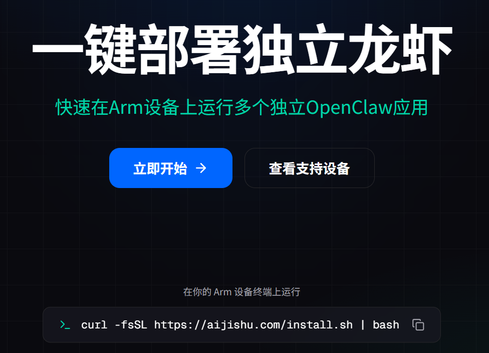

> **Arm 设备通用**：同一条命令适用于所有支持的 Arm 平台。在树莓派、Nvidia Jetson、RK3588、此芯 P1 等设备上，脚本会自动适配 Linux 环境，跳过 macOS 特有的步骤。

---

## 二、macOS 独有步骤

在 macOS 上首次安装时，系统可能需要先安装一些基础开发工具。这些步骤在 Linux 设备上不会出现。

### 2.1 Xcode Command Line Tools

如果你的 Mac 还没有安装过 Xcode 命令行工具，安装脚本会检测到并提示你安装。

**检测到缺少 Xcode CLT：**

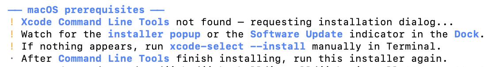

脚本会自动触发系统的安装流程。
> 需要特别注意的是，安装提示图标和弹窗不一定会弹出，可以注意Dock栏图标变化和切换任务管理来查看弹窗：

**安装提示图标：**

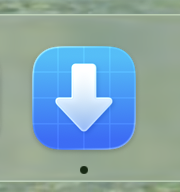

**安装弹窗：**

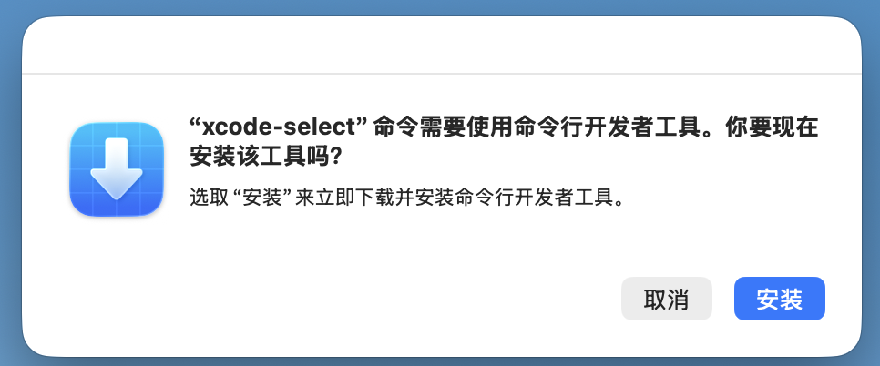

**许可协议：**

安装过程中会弹出许可协议窗口，点击「同意」继续。

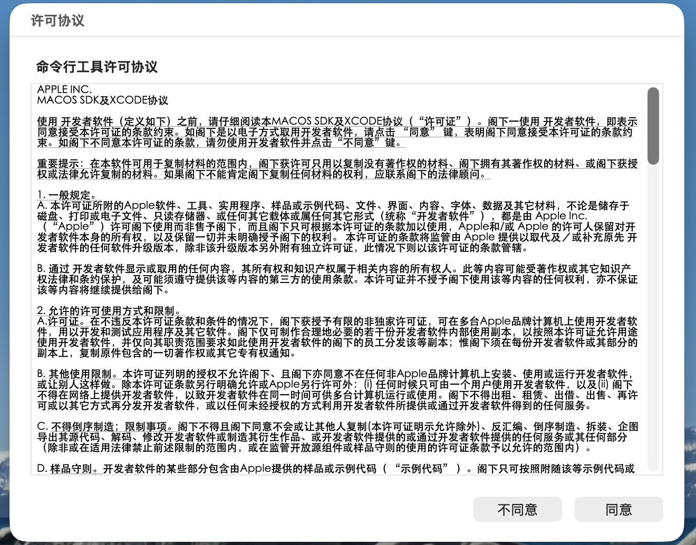

**安装完成：**

看到「软件已安装」的提示，点击「完成」即可。接下来需要重新运行相同的安装指令，进行后续步骤（Xcode Command Line Tools安装逻辑归macOS独立控制）。

```bash
curl -fsSL https://aijishu.com/install.sh | bash
```

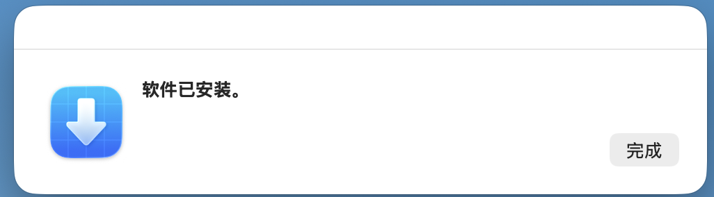

### 2.2 Homebrew

JishuShell 依赖 Homebrew 来管理 macOS 上的软件包（如 Colima 等）。如果系统中尚未安装 Homebrew，脚本会自动安装。

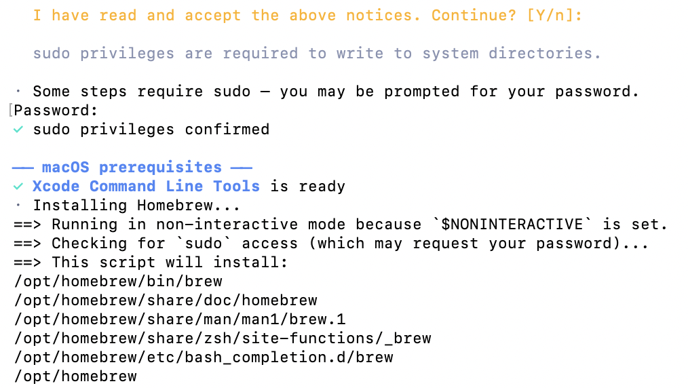

> **提示**：Homebrew 安装过程可能需要几分钟，取决于网络环境。

### 2.3 安装完成

所有组件安装完成后，终端会输出安装摘要，包括各组件的版本信息和面板访问地址。

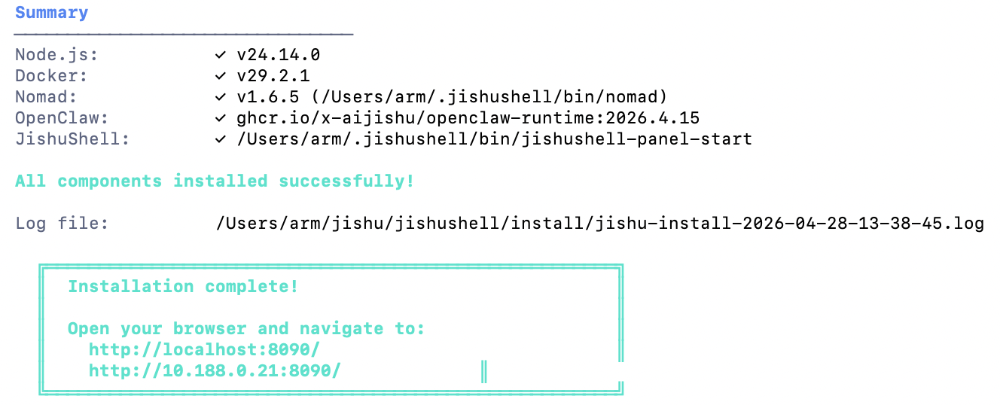

安装完成后，浏览器打开提示的地址即可访问 JishuShell 面板。

---

## 三、首次配置（所有 Arm 设备通用）

以下步骤在 macOS、树莓派、Jetson 等所有平台上完全一致。

### 3.1 设置管理密码

首次打开面板时，系统会要求设置一个管理密码。这个密码用于保护你的面板访问安全。

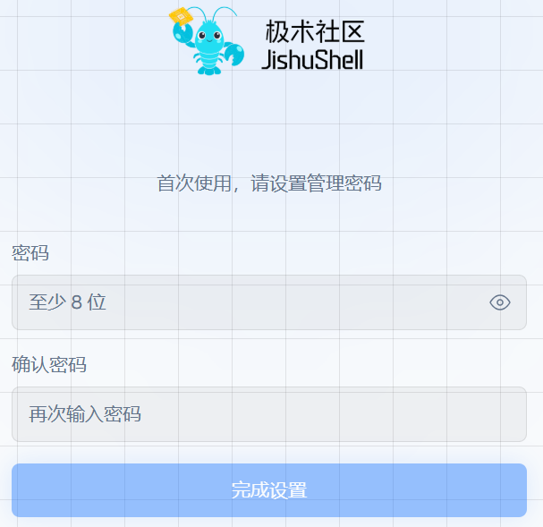

### 3.2 配置默认模型

设置密码后，进入模型配置页面。JishuShell 支持多家国内外模型提供商，并提供了部分提供商的开通入口，可以访问并获取 API Key。

也可以选择你已有 API Key 的提供商，填入密钥即可。

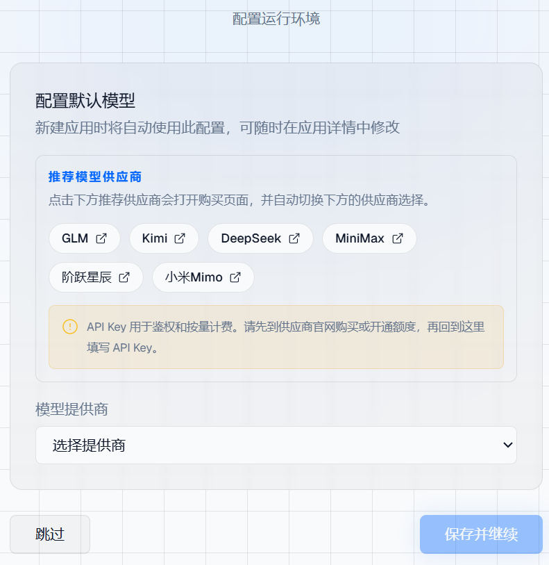

> **提示**：如果暂时没有 API Key，可以点击左下角「跳过」，后续在应用配置中再补充。

### 3.3 创建第一个 OpenClaw 应用

配置完成后，来到应用安装页面。选择 **OpenClaw** 类型，输入应用名称，点击「创建应用」。

OpenClaw 是 JishuShell 默认的 AI Agent 运行时，支持多模型、IM 通道、技能扩展。

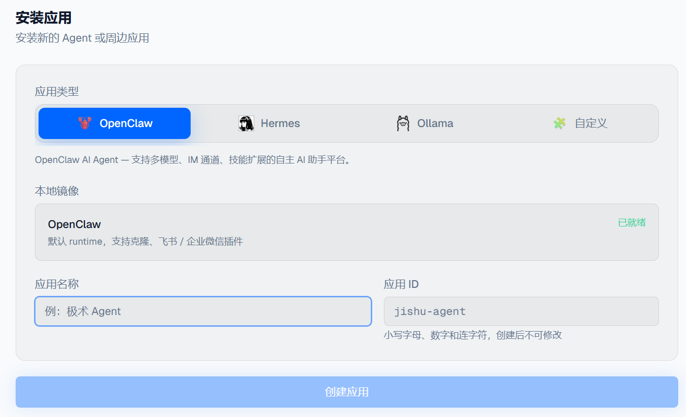

### 3.4 开始对话

应用创建完成后自动启动（建议多等待一段时间，直到完整看到OpenClaw自带得Dashboard）。点击进入应用详情，即可在内嵌的聊天界面中与 AI 对话。

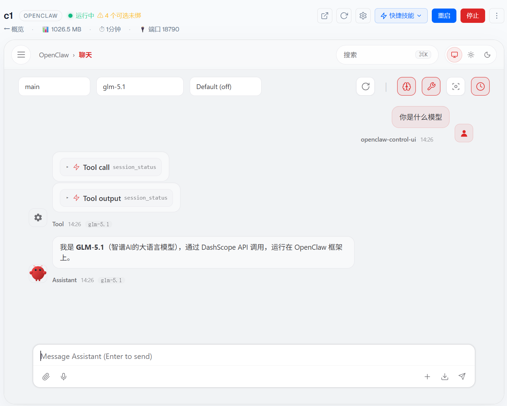

至此，你的 Mac Mini 已经成功运行了一个完整的 AI Agent！

---

## 总结

| 步骤 | macOS | Linux (树莓派/Jetson/RK3588) |
|------|-------|---------------------------|
| 安装命令 | `curl -fsSL https://aijishu.com/install.sh \| bash` | 相同 |
| Xcode CLT | 需要安装 | 不需要 |
| Homebrew | 需要安装 | 不需要 |
| 设置密码 | ✅ | ✅ |
| 配置模型 | ✅ | ✅ |
| 创建应用 | ✅ | ✅ |

**一条命令，从裸机到 AI Agent，全程约几分钟（主要依赖网络情况）。**

下一篇我们将介绍如何为 OpenClaw 配置 SearXNG 搜索引擎，让你的 AI Agent 获得更精准、更省 Token 的搜索能力。
