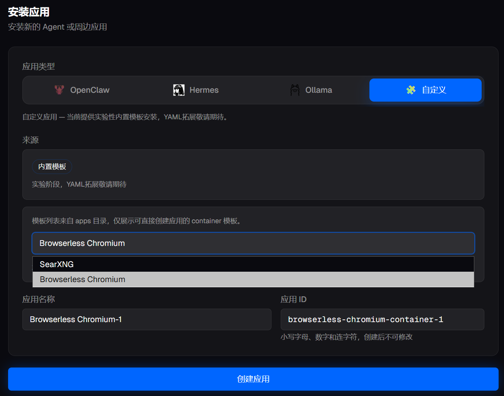
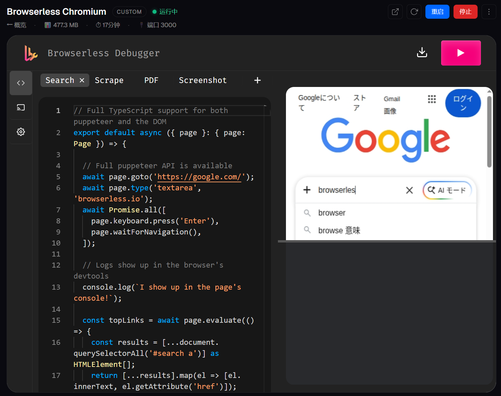
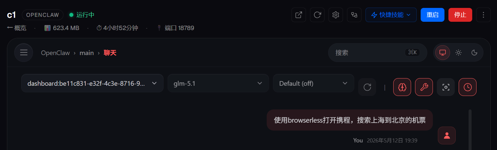
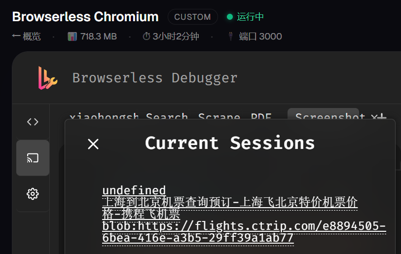
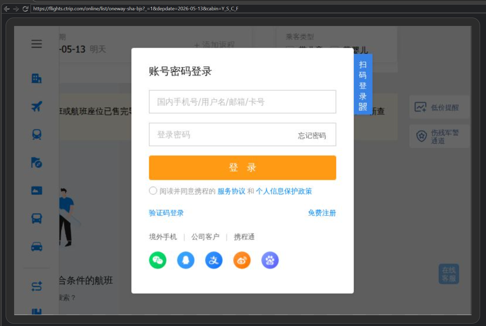

# [养虾指南 on Arm]Mac Mini玩转JishuShell - 浏览器自动化

---

> 上一篇我们为 OpenClaw 配置了 SearXNG 搜索增强。本文将为 Agent 接入 **Browserless**，让 AI 能真正"打开"网页、点击操作、截图，甚至以你的身份登录网站后自动完成任务。

---

## 一、为什么需要 Browserless？

OpenClaw 内置了浏览器操作能力，但在 JishuShell 的容器运行环境中，内置浏览器无法使用——容器内没有桌面环境，Chrome 无处启动。即便单独在容器里为 OpenClaw 配置一个 Chromium，它也只能供这一个实例专用，换一个 Agent 实例又得重新配一遍，登录状态也无法共享。

更通用的做法是将浏览器能力单独抽出来，作为一个独立服务运行。**Browserless** 就是这样一个服务：它在容器内启动一个 Chromium 实例，通过 CDP（Chrome DevTools Protocol）协议对外开放控制接口。任何支持 CDP 的客户端——无论是 OpenClaw、自定义脚本还是其他 Agent——都可以连接进来，像操作真实浏览器一样：打开页面、等待动态内容加载、填写表单、点击按钮、截图、抓取渲染后的页面内容。

相比直接在 Mac 上装浏览器让 Agent 使用，Browserless 容器方案有两个核心优势：

### a. 与个人浏览器完全隔离

Agent 操作的是容器里独立的 Chromium 实例，与你日常用的 Safari 或 Chrome 毫无关联。AI 的所有浏览行为——无论是访问什么网站、填写了什么内容——都在容器内沙盒里进行，不会污染你的书签、历史记录、密码管理器，也不会影响你正在浏览的页面。

### b. 多个 Agent 共享同一个浏览器和登录状态

Browserless 通过 CDP WebSocket 接受连接，多个 Agent 实例可以同时连接到同一个 Browserless 服务，共享**同一份用户数据目录**（cookies、localStorage、session）。

这意味着：你只需要在 Browserless 里登录一次携程、小红书或任何网站，之后所有连接到这个 Browserless 的 Agent 都可以直接以已登录状态操作，无需每次重新授权。JishuShell 将这份用户数据持久化保存在宿主机上，容器重启后登录状态同样保留。

---

## 二、安装与绑定 Browserless

### 2.1 安装应用

进入 JishuShell 面板，点击右上角「+ 安装」，应用类型切换到**自定义**标签。在内置模板下拉列表中选择 **Browserless Chromium**，保持默认的应用名称和 ID，点击「创建应用」。



JishuShell 会自动拉取镜像、创建容器并启动服务，整个过程无需手动配置 Docker。

### 2.2 确认运行并测试

安装完成后，进入 Browserless Chromium 实例页，可以看到页面主体嵌入了 **Browserless Debugger** 界面。Debugger 是 Browserless 自带的可视化工具，左侧提供了代码编辑器，右侧实时显示浏览器画面。

默认内置了一段 Search 示例代码，演示如何用 Puppeteer API 打开 Google 并执行搜索。点击右上角的**执行按钮（▶）**，右侧即可看到浏览器实际打开 Google 的过程。


执行后右侧会显示 Google 搜索页面的实时截图，确认 Browserless 工作正常。



### 2.3 与 OpenClaw 绑定

Browserless 运行起来后，回到 OpenClaw 实例页，进入**连接**标签。在「浏览器自动化」一栏的下拉菜单中，选择正在运行的 **Browserless Chromium (browser-ws)**，完成绑定。


绑定完成后，JishuShell 会自动将 Browserless 的 CDP WebSocket 地址写入 OpenClaw 配置，无需手动填写任何 URL 或端口。

---

## 三、使用 Browserless

### 3.1 在对话中指定使用浏览器

绑定完成后，直接在对话框里描述你想做的事即可。需要注意的是：**不同模型的工具调用能力差异较大**。能力弱的模型可能不会主动选择使用 browser 工具，建议在提示词里明确指出。

例如，想让 Agent 帮你搜携程机票，可以这样说：

> 使用 browserless 打开携程，搜索上海到北京的机票



加上"使用 browserless"或"用浏览器打开"这样的指示，模型会更准确地调用 browser 工具，而不是退回到普通的网页抓取方式。

### 3.2 在 Browserless 实例页观测实际操作

Agent 发起 browser 操作后，切换到 **Browserless Chromium 实例页**，点击左侧工具栏的**投屏图标**，可以看到「Current Sessions」弹窗，列出所有当前活跃的浏览器 session。

点击任意 session 链接，即可在 Debugger 右侧实时看到 Agent 正在操作的浏览器画面，以及完整的 DevTools（网络请求、控制台日志、元素结构）。



图中可以看到 Agent 已经成功打开了携程的上海到北京航班列表页面。

### 3.3 手动登录，让 Agent 以已登录状态操作

遇到需要登录才能查看完整内容的情况，可以在 Browserless Debugger 里**手动完成一次登录**，之后 Agent 就可以直接复用这份登录状态。

在 Debugger 的代码编辑区，新建一个 tab，写入以下代码打开目标网站：

```typescript
export default async ({ page }: { page: Page }) => {
  await page.goto('https://flights.ctrip.com');
  // 页面打开后手动在右侧操作登录，无需点击执行
};
```

点击执行后，右侧浏览器画面会出现网站的登录界面。此时直接在右侧画面里**点击、输入账号密码或扫码**完成登录。



登录完成后，Cookie 和 Session 会自动写入持久化的用户数据目录。以后无论是重启容器还是让 Agent 重新发起操作，都会保持已登录状态，不需要再次授权。

---

## 小结

| 能力 | 说明 |
|------|------|
| **浏览器隔离** | 独立容器，与个人浏览器完全分离 |
| **登录状态共享** | 多个 Agent 共享同一份 Cookie，一次登录长期有效 |
| **实时观测** | 通过 Debugger Session 面板随时查看 AI 的浏览操作 |
| **手动介入** | 遇到风控或登录弹窗，可直接在 Debugger 中手动操作 |

配置好 SearXNG 和 Browserless 之后，你的 OpenClaw 已经具备了相当完整的信息获取能力：前者处理快速、结构化的搜索摘要，后者处理需要真实浏览器才能访问的动态页面和登录场景。
