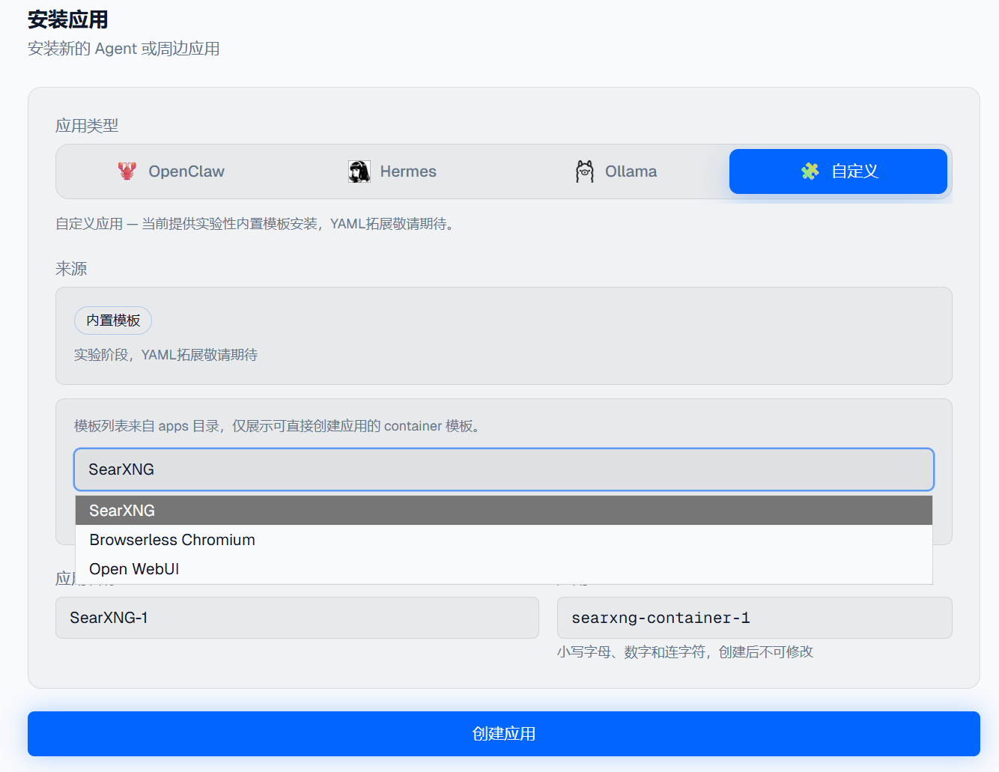
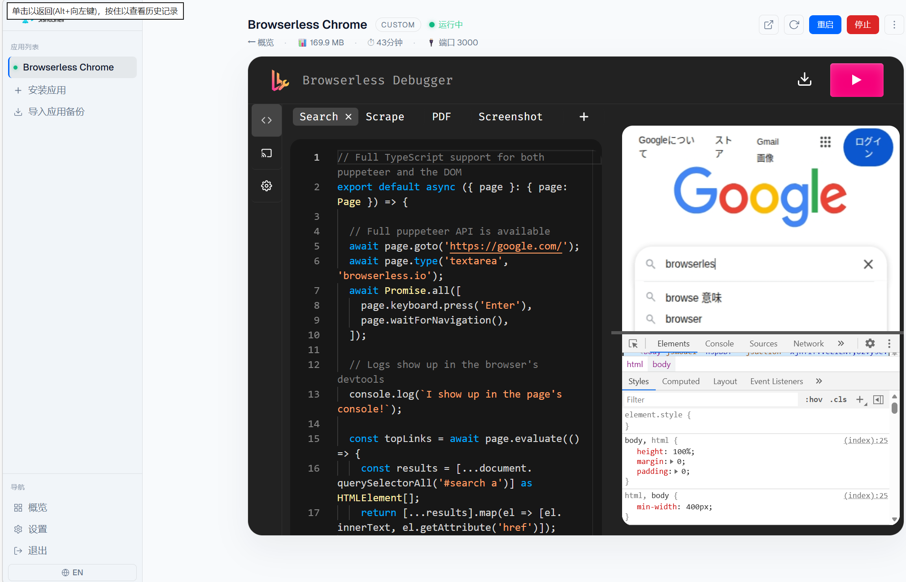

# JishuShell更新日志 | v0.4.30

---

JishuShell v0.4.30 正式发布。本次更新继续围绕“可扩展的 AI 应用管理与编排平台”演进：一方面进一步扩充了可直接安装的周边应用，另一方面把应用之间的自动发现与能力连接做成了默认体验，让各类工具不再只是单独安装，而是可以逐步串起来协同工作。

---

## 新特性

### 更多周边应用支持：继续强化 JishuShell 的拓展能力

这一版新增了更多可直接安装和接入的周边应用，进一步体现 JishuShell 作为统一运行与集成平台的拓展能力。现在除了核心 Agent Runtime 之外，也可以把更多配套工具作为“应用”纳入同一套安装、生命周期管理和能力暴露体系中。

当前版本先预置了 3 款典型周边应用，用来覆盖搜索增强、浏览器自动化与 Web 界面集成等不同场景。它们的意义不只是“多了几个可安装项”，而是验证了 JishuShell 这套应用接入模型已经可以稳定承载更多第三方能力。

- 支持通过统一入口安装更多 AI 周边应用
- 应用安装后可自动纳入实例管理与能力暴露体系
- 预置 3 款示例应用，后续还会继续开放更多第三方支持

<div style="text-align: center;"></div>

> 更多第三方应用支持正在持续接入中，后续会逐步补齐更丰富的工具类型与模板。

---

### 应用间能力自动发现与连接：让安装后的应用真正协同起来

这一版的另一项关键改进，是把应用间的能力发现与连接流程进一步自动化。过去，很多工具即使已经安装完成，仍然需要用户手工确认端口、路径或 API 地址，才能把它接到另一个应用里。现在这类重复配置正在被逐步收敛为系统自动处理。

JishuShell 会根据应用声明的 capability 与连接需求，自动识别可用能力，并优先把“已经装好、已经可用”的本地服务连接起来。这样做的直接好处是，用户不需要反复记忆某个服务暴露在哪个端口、哪个路径下，也不用为每个应用单独维护一套连接配置。

- 自动发现应用已暴露的能力
- 自动为依赖方补齐本地连接信息
- 降低跨应用协作的配置门槛，减少手工接线步骤

<div style="text-align: center;"></div>

<div style="text-align: center;"></div>

<div style="text-align: center;"></div>

这意味着 JishuShell 正在从“应用管理面板”进一步走向“应用连接底座”：不仅负责把应用装起来，也负责把它们更自然地串联起来。

---

### SearXNG 示例：本地搜索能力接入更直观

为了让应用连接的效果更容易理解，这一版也补充了一个更具体的 **SearXNG** 使用示例。通过 JishuShell 安装和连接后，本地搜索服务可以更自然地作为上层 Agent 或 AI 应用的辅助能力存在。

SearXNG 这一类搜索能力的价值，在于把“联网检索”从外部依赖，变成一个可控、可替换、可复用的本地能力组件。对需要检索增强、联网问答或信息补全的工作流来说，这会比零散手工接入更稳定，也更容易复用到不同应用之间。

- 搜索服务可作为独立应用安装和运行
- 安装后可被其他应用自动发现并接入
- 示例场景更适合用来理解应用间连接的实际价值

<div style="text-align: center;"></div>

<div style="text-align: center;"></div>

---

### Browserless（实验阶段）

这类应用的接入价值在于，JishuShell 不再只管理“单一 Agent Runtime”，而是开始承载更多成熟但外部来源的工具型应用，并尽可能把它们纳入统一的安装、运行、嵌入与连接体验中。

<div style="text-align: center;"></div>

> Browserless 当前都仍处于实验阶段，更适合有经验的开发者优先尝试与反馈。我们尤其欢迎关于安装体验、嵌入显示、能力连接与实际工作流集成方面的反馈，这会直接帮助后续版本继续完善第三方应用支持。

---

**升级方式：**

```bash
npm install -g jishushell@0.4.30
```

或通过 Dashboard 顶部的版本更新横幅一键升级。

---