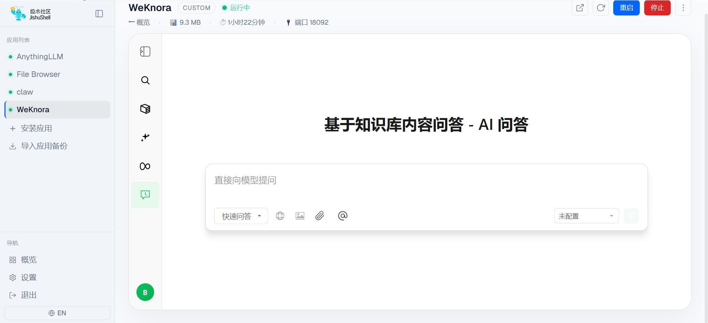
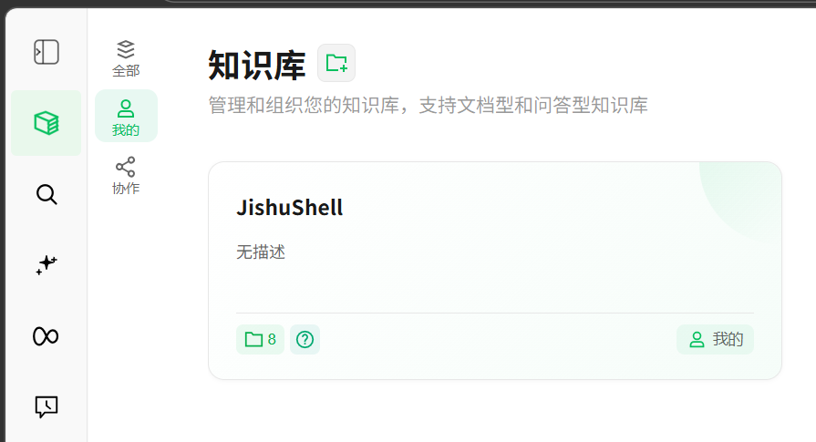
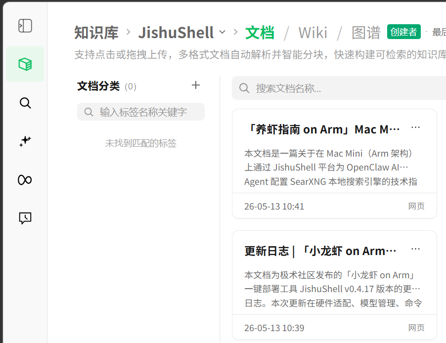
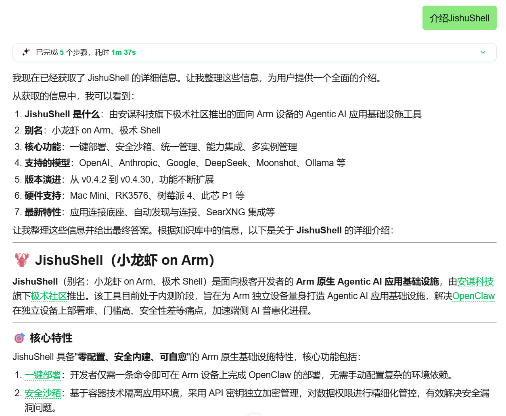
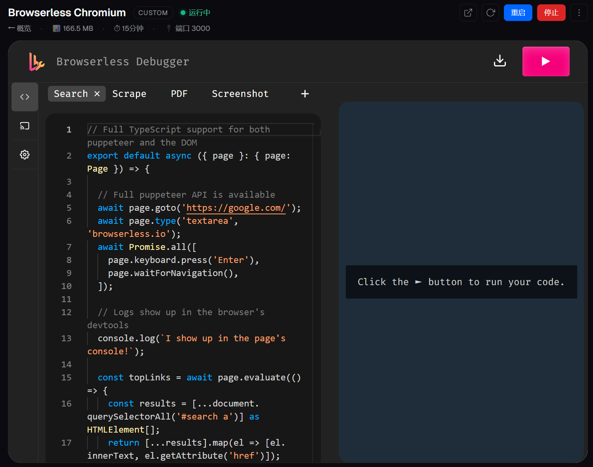
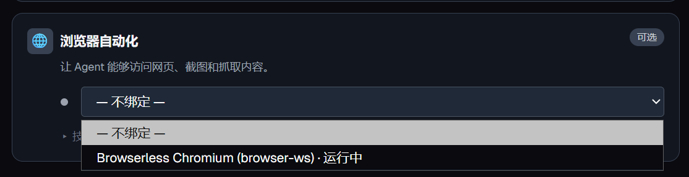
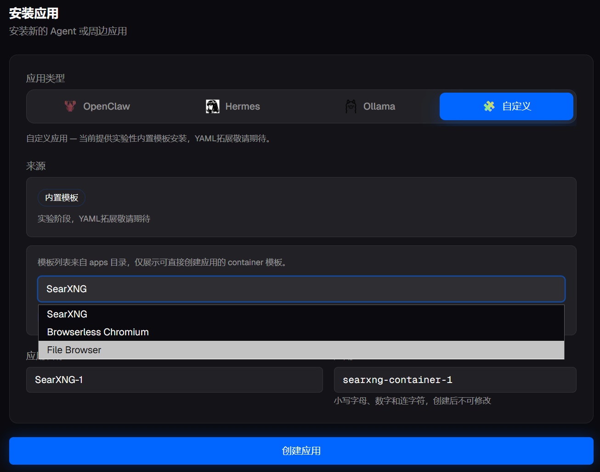
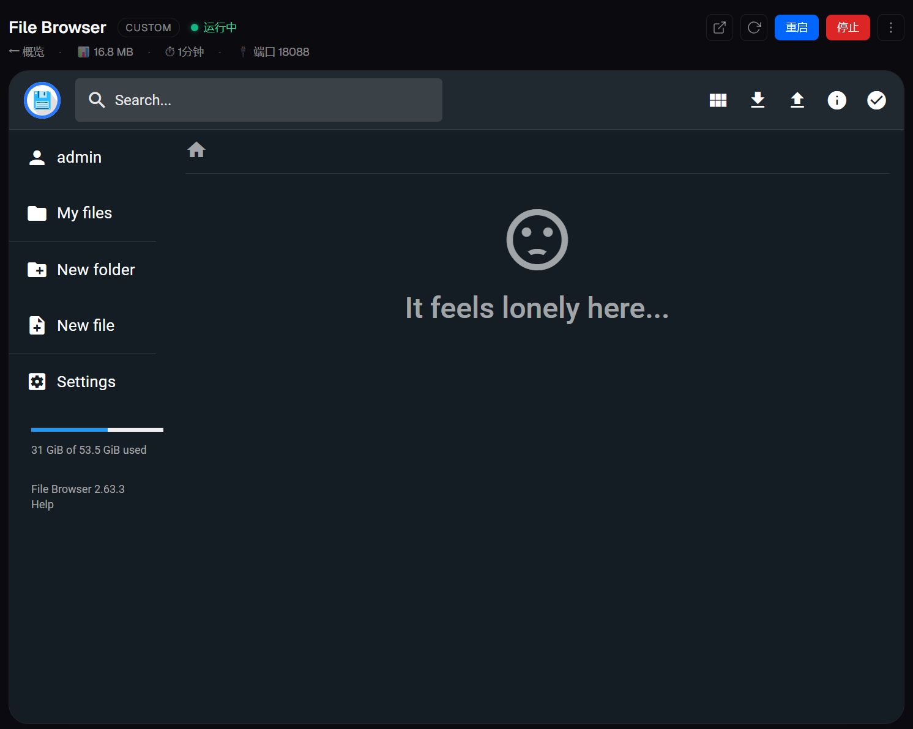
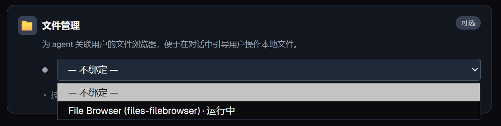

# JishuShell更新日志 | v0.5.15

---

JishuShell v0.5.15 正式发布。本次更新有两条主线：一是 **WeKnora 知识库支持正式上线**，让 Agent 可以基于你自己的私有内容进行问答；二是继续扩充周边应用模板，为 Agent 补齐浏览器自动化与本地文件管理两项常用工具。

---

## 重点更新：WeKnora 知识库支持

### 为什么知识库对个人使用很重要？

通用 AI 模型的训练数据是公开的、截止到某个时间点的。但你真正想问的问题，往往不是"ChatGPT 知道什么"，而是"**我自己积累的这些内容里，有没有答案**"——你收藏的文章、整理的笔记、读过的文档、产品的设计说明……这些东西模型不会知道，搜索引擎也未必能检索到。

知识库解决的正是这个问题：把你的私有内容变成 Agent 可以检索和引用的上下文，让对话的起点不再是一片空白，而是建立在你已经积累的信息上。对个人用户来说，这往往比接入更强的模型更实用——模型能力的天花板很高，但"让它了解我"这一步，才是让 AI 真正有用的关键。

### 与 JishuShell 的集成

本次更新通过 WeKnora 应用的方式将知识库能力引入 JishuShell，安装后可以直接在实例页中使用。

**第一步：安装并打开 WeKnora 实例**

在 JishuShell 中安装 WeKnora 后，进入实例页，可以看到嵌入的 WeKnora 对话界面。右侧模型栏显示「未配置」，说明此时 WeKnora 还没有连接到语言模型——它默认作为独立知识库服务运行，等待你填入文档后再接入模型使用。

<div style="text-align: center;"></div>

**第二步：在知识库中创建你的文档集**

进入 WeKnora 的**知识库**功能，可以看到「我的」知识库列表。点击新建，创建一个专属的文档集——例如以项目名称命名，或按主题分类。这里已经建好了一个名为「JishuShell」的知识库，包含 8 个文档。

<div style="text-align: center;"></div>

**第三步：向知识库上传文档**

进入知识库详情页，支持点击或拖拽上传多格式文档（PDF、Word、网页链接、Markdown 等）。WeKnora 会自动解析并智能分块，快速构建可检索的向量索引。截图中可以看到已经上传了多篇「养虾指南 on Arm」系列文章和 JishuShell 更新日志，这些内容来自博客和官方文档，构成了一个关于 JishuShell 的专属知识库。

<div style="text-align: center;"></div>

**第四步：基于知识库内容进行问答**

回到对话界面，切换到「知识库问答」模式，选择刚才创建的知识库，向 Agent 提问。Agent 会先在知识库中检索相关内容，再结合语言模型生成回答。截图中展示的是询问 JishuShell 介绍的效果——Agent 基于上传的文档完成了 5 个检索步骤，输出了一份包含项目定位、核心特性、硬件支持等详细信息的完整介绍，内容完全来自知识库文档，而非模型的通用知识。

<div style="text-align: center;"></div>

---

## 更多周边应用支持：搜索之外，继续多元化

v0.4.30 通过 SearXNG 的接入验证了"本地独立搜索服务"这条路，v0.5.15 继续沿着这个方向延伸：Agent 的实际工作不只是检索信息，还需要能打开网页、和动态页面交互，以及读写本地文件。

这两项能力以往要么需要用户自己折腾 Docker、手工配端口，要么根本没有现成的集成路径。本次更新把它们做成了可以直接从安装界面一键创建的内置模板，安装后自动纳入 JishuShell 的应用管理和能力连接体系，和其他应用的接入体验保持一致。

---

## Browserless：让 Agent 拥有真正的浏览器

### 安装

进入 JishuShell 面板，点击「安装应用」，切换到**自定义**标签，在内置模板下拉列表中选择 **Browserless Chromium**，保持默认应用名称，点击「创建应用」即可。

<div style="text-align: center;"></div>

安装完成后，进入 Browserless Chromium 实例页，可以看到页面主体嵌入了 **Browserless Debugger**。左侧是代码编辑区，内置了多个示例脚本（Search、Scrape、PDF、Screenshot）；右侧实时显示浏览器执行结果。点击右上角的执行按钮（▶），即可在右侧看到浏览器实际运行的画面。

<div style="text-align: center;"></div>

### 与 OpenClaw 绑定

进入 OpenClaw 实例页，打开**连接**标签，在「浏览器自动化」一栏的下拉菜单中选择正在运行的 **Browserless Chromium (browser-ws)**，完成绑定。

<div style="text-align: center;"></div>

绑定后，JishuShell 会自动将 Browserless 的 CDP WebSocket 地址写入 OpenClaw 配置，无需手动填写任何 URL 或端口。之后在对话中告诉 Agent "用浏览器打开某个网页"，它就可以真正启动一个 Chromium 实例去完成操作。

---

## FileBrowser：让 Agent 能访问本地文件

### 安装

同样在「安装应用 → 自定义」界面，从内置模板下拉列表中选择 **File Browser**，点击「创建应用」。

<div style="text-align: center;"></div>

安装完成后，进入 File Browser 实例页，可以看到页面主体嵌入了 FileBrowser 的 Web 界面——一个轻量的文件管理器，支持浏览目录、上传下载、新建文件夹等操作，映射到 JishuShell 的本地数据目录。

<div style="text-align: center;"></div>

### 与 OpenClaw 绑定

进入 OpenClaw 实例页，打开**连接**标签，在「文件管理」一栏的下拉菜单中选择正在运行的 **File Browser (files-filebrowser)**，完成绑定。

<div style="text-align: center;"></div>

绑定后，Agent 可以在对话中读取、写入和管理本地文件，文件操作的结果也可以直接在 FileBrowser 界面中查看和下载。

---

**升级方式：**

```bash
npm install -g jishushell@0.5.15
```

或通过 Dashboard 顶部的版本更新横幅一键升级。

---
