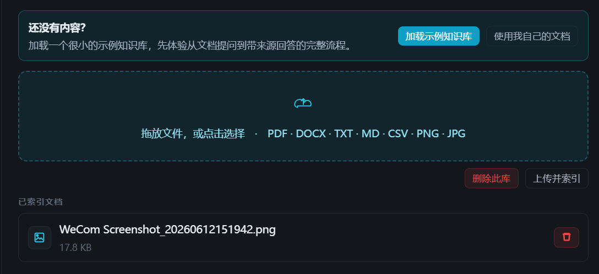
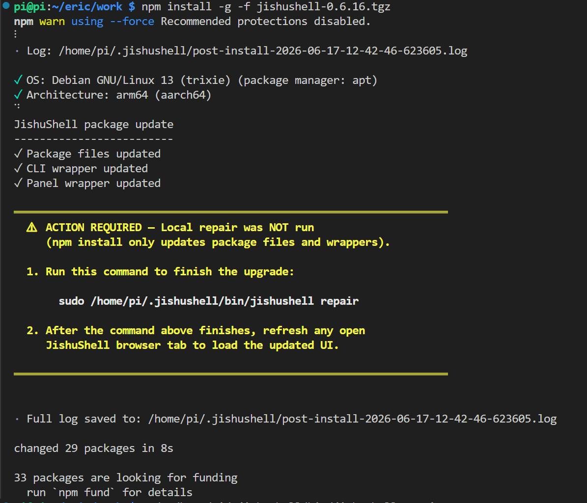
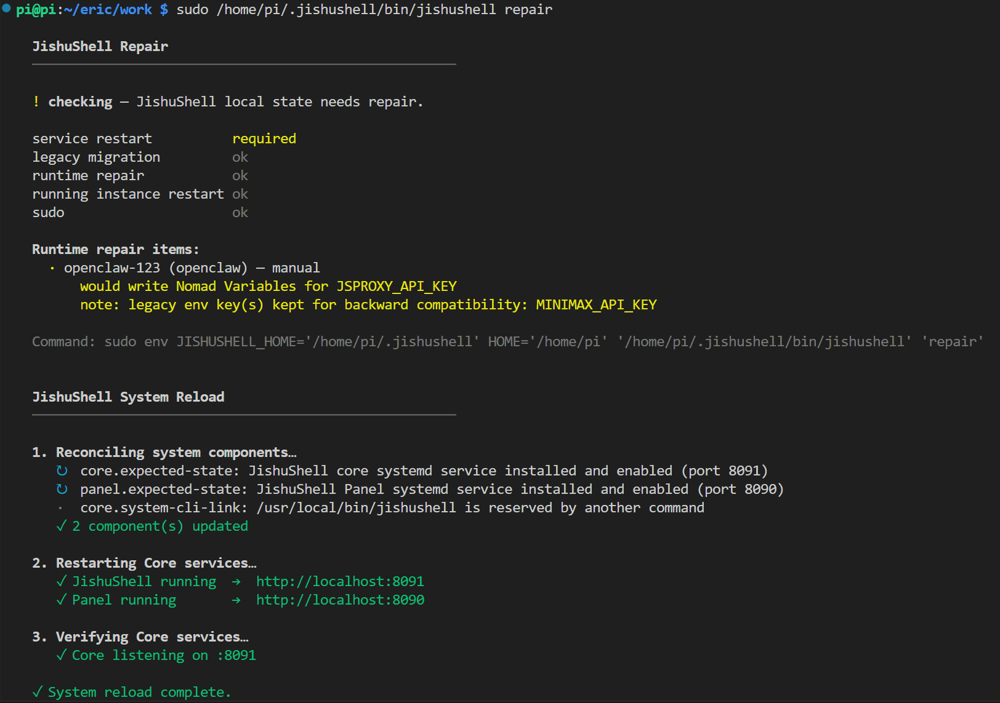

# JishuShell更新日志 | v0.6.18

---

JishuShell v0.6.18 正式发布。本次更新有两条主线：一是 **内置知识库 JishuShell KB 的一轮集中增强**——支持图片与扫描件的 OCR 导入、直接从网址导入内容、检索更快更准；二是 **应用更新体验的全面打磨**——应用有新版本会主动提示、内置应用支持自助升级、升级过程统一走「修复」流程更稳更省心。此外，面板还带来了浏览器调试画面等体验改进，并为有需要的进阶用户提供了可选的 Agent 外设访问能力。

---

## 重点更新：知识库 KB 增强

继 v0.6.5 把 **JishuShell KB** 做成内置应用之后，这一轮针对「资料怎么进来」和「检索好不好用」做了一批集中增强。

### 更多的资料入口：图片、扫描件、网址

过去知识库主要吃文本类文档，这一轮把入口拓宽了：

- **图片 / 扫描件 OCR 导入**：直接上传图片或扫描件，KB 会做 OCR 把里面的文字提取出来、纳入检索；OCR 后端可配置，支持接入视觉模型（VLM）以获得更好的版面与中文识别效果。
- **从网址导入**：贴一个网页地址，KB 就能抓取正文并导入知识库，省去「先存成文件再上传」的中间步骤。这条链路做了严格的安全加固——会拦截指向内网、本机等敏感地址的请求，防止被诱导去访问不该访问的内部服务。

如下图，上传区现已支持 PDF / DOCX / TXT / MD / CSV / **PNG / JPG** 多种格式拖拽导入——其中 PNG/JPG 截图会走 OCR 提取文字（图中「已索引文档」里的 PNG 截图即为一例）；首次使用时也可以「加载示例知识库」，一键体验从导入到带引用问答的完整流程。

<div style="text-align: center;"></div>

### 检索更快、更准、更稳

- **默认向量优先检索**：默认检索策略切换为「向量优先」，对语义相近但措辞不同的提问召回更准。
- **更省内存**：内存中的向量索引做了量化压缩，在树莓派 / 边缘盒子这类内存吃紧的设备上更从容。
- **重排失败不再报错**：当外部重排服务（rerank）临时不可用时，KB 会自动回退到重排前的结果继续作答，而不是把整个请求打成失败——问答的可用性更稳。
- **导入过程可观测**：文档导入时可以看到解析、分块、向量化、建索引各阶段的耗时瀑布图，慢在哪一步一目了然；长任务也能随时取消。

### 自助检查与升级

KB 现在会自查版本，发现有新版时在界面顶部给出更新提示，并支持**自助升级**——和下文介绍的应用升级体验保持一致，不必再手动替换文件。

### 新手首答引导

新建知识库后，KB 提供了一条「首次提问」的引导演示，帮你快速体验「导入资料 → 带引用问答」的完整闭环。

---

## 重点更新：应用更新更省心

### 从「自己留意版本」到「界面主动提示」

过去要升级一个应用，你得自己留意有没有新版本，再手动去更新；万一升级过程中实例的配置出了岔子，还可能落到一个「升级到一半、跑不起来」的尴尬状态。v0.6.18 把这条链路整体做顺了——升级这件事，从「你去找版本」变成了「版本来找你」。

- **主动提示新版本**：仪表盘与实例详情页会在应用有可用更新时给出升级提示，你不用再盯着版本号——有更新，界面会主动告诉你。
- **内置应用自助升级**：以知识库 KB 为代表的内置应用，现在能自查版本、在界面顶部弹出更新横幅，并一键完成自助升级，升级包直接装入运行时，无需手动替换文件。
- **升级即自愈**：所有更新动作统一走「修复（repair）」流程——升级不只是替换文件，还会顺带校正实例的 provider 密钥兼容性、运行时配置等，把「升级后坏掉」的概率压到最低。

---

## 面板体验改进

面板（GUI）这一轮还有几处你能直接看到的变化：

- **Browserless 浏览器调试画面**：使用浏览器自动化能力时，面板可以直接看到 Browserless 的实时画面快照，排查抓取/渲染问题更直观；没有画面时自动隐藏对应区域，不占版面。
- **连接页自动刷新**：连接（能力绑定）页的提供方下拉，在切回该标签页时会自动刷新，避免看到已经过期的候选列表。

---

## 更多改进

- **Agent 外设访问（可选）**：新增可选的「提权模式」，用一条命令 `jishushell job privileged <实例ID> on` 即可让指定的 Agent 实例（OpenClaw / Hermes）像原生安装一样访问摄像头、GPU、麦克风等本机外设；默认仍保持容器加固不变，仅对你显式开启的实例生效。⚠️ 提权会放大该实例的安全面（沙箱隔离减弱、摄像头/麦克风涉及隐私），建议只对可信、且确实需要外设的实例开启。
- **自定义应用可指定执行用户**：自定义应用支持指定容器内的执行用户，适配更多镜像的权限约定。
- **应用启动更可靠**：修复 Filebrowser、OpenWebUI、ComfyUI 等应用偶发卡在「启动中」、控制界面迟迟不出现的问题。
- **macOS 升级更顺**：修复 macOS 下升级后核心服务重载、启动脚本执行的若干问题，自动重启链路更可靠。
- **安全更新**：处理了一批依赖项安全告警。

---

**升级方式：**

```bash
npm install -g jishushell@0.6.18
```

或通过 Dashboard 顶部的版本更新横幅一键升级。

如果你是**系统级安装**（已注册 systemd / launchd 服务），`npm install` 只会刷新包文件与 CLI / 面板启动脚本，并不会重启服务、迁移实例。这一步完成后，命令行会用醒目的 `ACTION REQUIRED` 提示你「本地修复尚未执行」，并给出收尾命令——照着复制执行即可：

<div style="text-align: center;"></div>

按提示执行 `sudo jishushell repair`（若 sudo 找不到命令，用提示里的绝对路径 `sudo ~/.jishushell/bin/jishushell repair`）即可完成收尾。这正是上文「升级即自愈」所走的流程——`repair` 不只是替换文件，它会先**自检本地状态**（服务是否需重启、运行时配置、provider 密钥兼容性、运行中实例是否需重启），再统一**对账并重载系统组件**：重新装好 core / 面板的 systemd 服务、重启并验证 core（:8091）与面板（:8090），最后给出「System reload complete」。整个过程一条命令搞定，把「升级后跑不起来」的概率压到最低：

<div style="text-align: center;"></div>

收尾完成后，刷新任意已打开的 JishuShell 浏览器标签页，即可加载更新后的界面。

> 普通的 `npm install -g jishushell`（非系统级服务安装）不会出现这一步，包文件刷新后即可直接使用。

---
