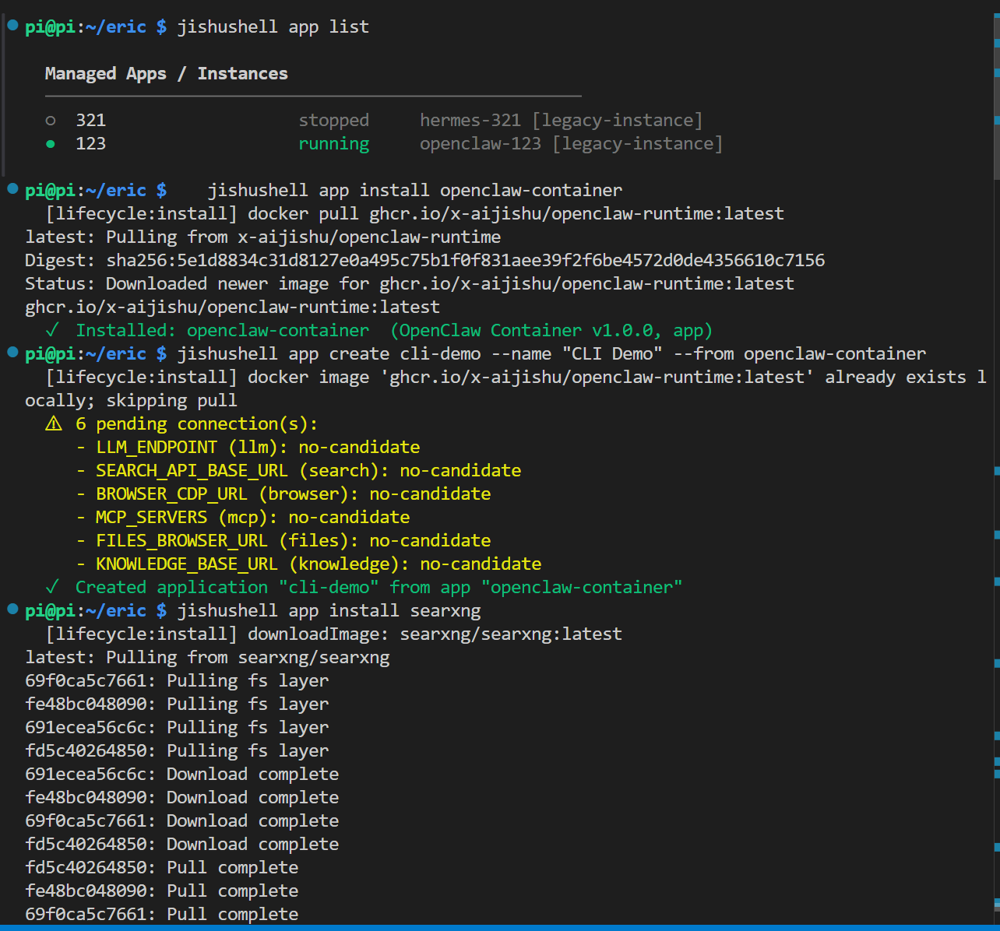
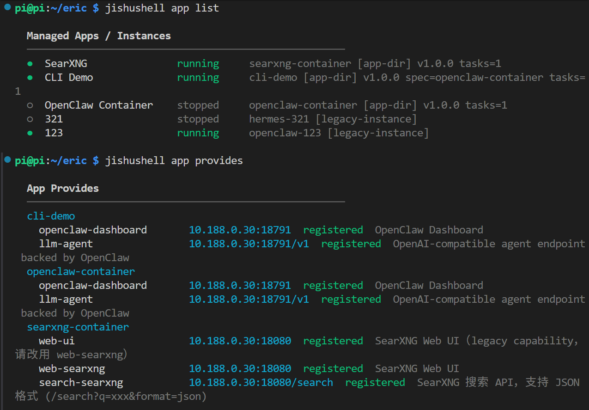
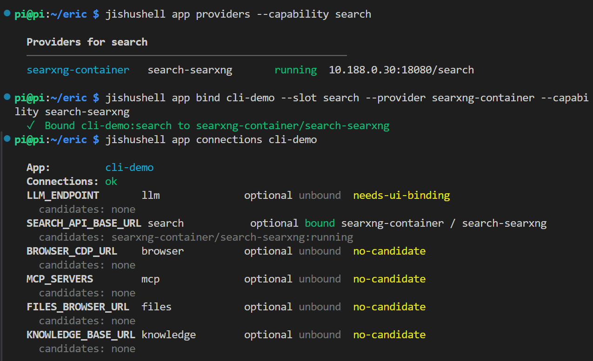
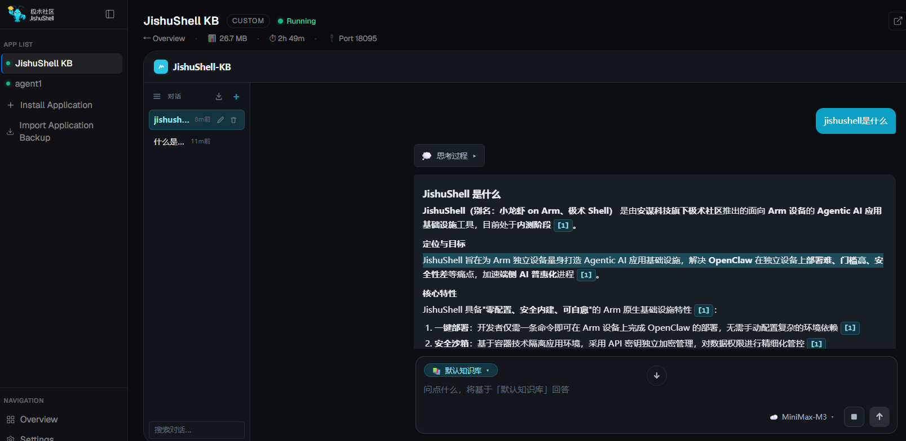
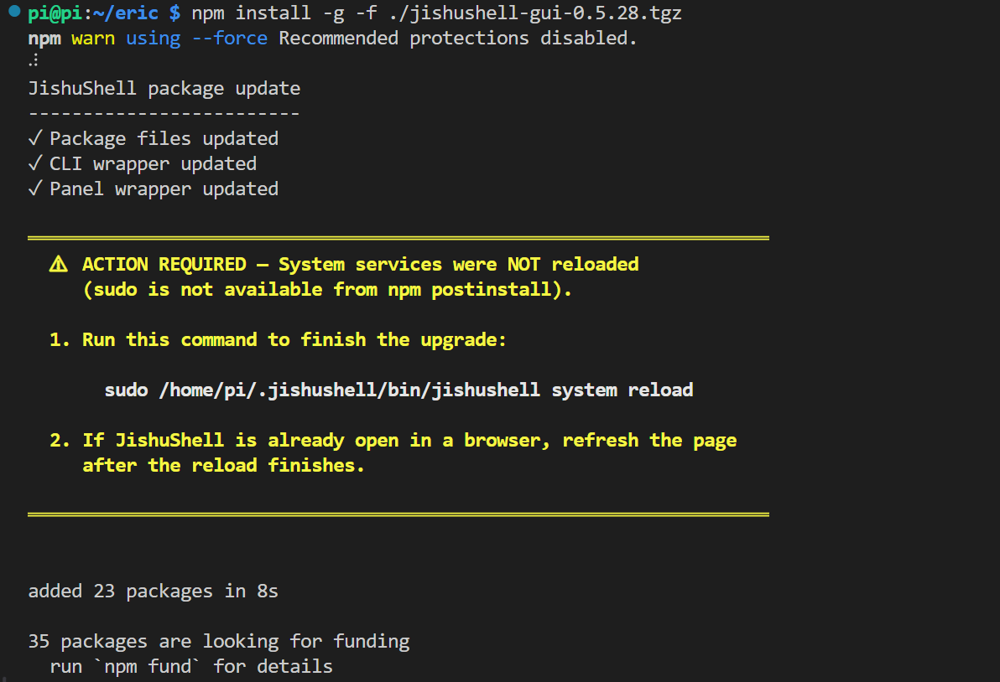
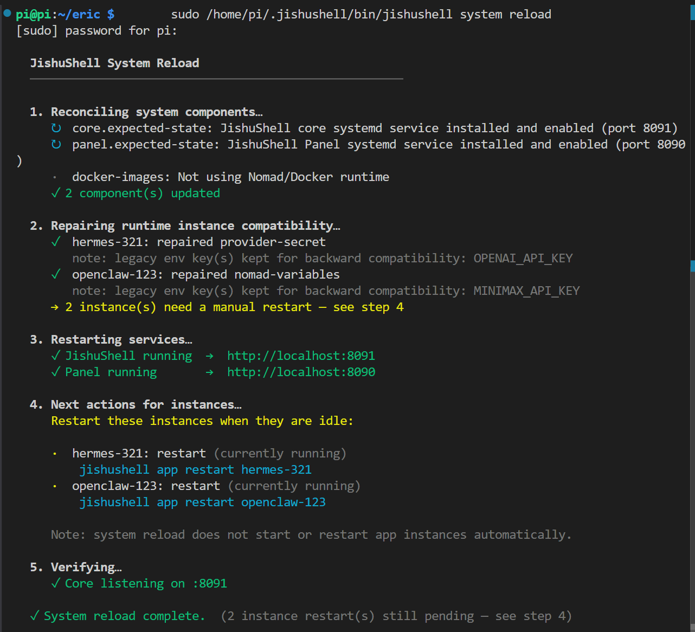

# JishuShell更新日志 | v0.6.5

---

JishuShell v0.6.5 正式发布。本次更新有两条主线：一是 **命令行应用管理（`jishushell app`）正式上线**，让你无需打开面板，就能在终端里完成应用的安装、实例创建、能力查询与连接绑定；二是配合 **开源核心（open-core）架构拆分**，重写了升级与系统重载链路，让面板 GUI 解耦为独立包之后，升级过程依然平滑可控。

---

## 重点更新：命令行应用管理

### 为什么要把应用管理搬到命令行？

JishuShell 的面板一直是图形化的——点几下就能装应用、建实例、连能力，这对日常使用很友好。但当你开始把 JishuShell 部署到一排树莓派、或者想把"装好一套环境"这件事写进脚本里反复执行时，鼠标就帮不上忙了。

v0.6.5 把面板背后的应用管理能力完整地暴露到了命令行：`jishushell app` 下的一组子命令覆盖了应用的完整生命周期——查看、安装、创建实例、查询能力、绑定连接。每一步都能在 SSH 会话里完成，也能写进安装脚本、CI 流程或运维 playbook 里。图形界面负责"上手快"，命令行负责"可复制、可自动化"，两者共用同一套底层。

### 第一步：查看、安装与创建

`jishushell app list` 列出当前所有的应用与实例及其运行状态。`jishushell app install <来源>` 安装一个应用——来源可以是内置模板 id（下图安装的 `openclaw-container` 即对应 OpenClaw 运行时容器）、本地 YAML 文件，或一个 HTTPS YAML 地址；JishuShell 会按应用声明（app spec）拉取所需的镜像或二进制。安装完成后，用 `jishushell app create <id> --name "<显示名>" --from <app>` 基于这个模板创建出一个具体实例——创建时会列出该应用声明的所有连接需求（如 LLM、搜索、浏览器、文件、知识库等），方便你后续按需绑定。

<div style="text-align: center;"></div>

### 第二步：查看应用提供的能力

实例创建后，再次 `jishushell app list` 可以看到新建的实例已在运行。`jishushell app provides` 则换一个视角，列出每个应用**对外提供**了哪些能力（capability）及其访问地址——例如 OpenClaw 实例提供 `openclaw-dashboard` 与 `llm-agent`，SearXNG 提供 `web-searxng` 与 `search-searxng` 搜索接口。这张"能力清单"是后续连接绑定的基础。

<div style="text-align: center;"></div>

### 第三步：绑定能力并检查连接

知道了"谁提供什么"，就可以把它们连起来。`jishushell app providers --capability <能力>` 查询某个能力当前有哪些可用的提供方；`jishushell app bind <app> --slot <槽位> --provider <提供方> --capability <能力>` 把目标应用的某个连接槽绑定到指定的提供方——下图中把 `cli-demo` 的 `search` 槽绑定到了 SearXNG 的搜索能力。最后用 `jishushell app connections <app>` 检查所有连接槽的状态，可以清楚看到哪些已绑定（bound）、哪些待配置（unbound / no-candidate）。

<div style="text-align: center;"></div>

绑定完成后，JishuShell 会自动把提供方的访问地址写入目标应用的运行时配置——和在面板「连接」标签里下拉选择的效果完全一致，无需手动填写任何 URL 或端口。

---

## 新增应用：JishuShell KB 知识库

### 让 Agent 基于你自己的内容回答

通用模型只知道公开的、有截止日期的训练数据，但你真正想问的，往往是"**我自己积累的这些内容里有没有答案**"——你的笔记、文档、产品说明、博客文章……这些模型不会知道。知识库要解决的就是这件事：把私有内容变成 Agent 可以检索、引用的上下文，让回答建立在你已有的信息之上。

v0.6.5 把这项能力做成了一个开箱即用的内置应用 **JishuShell KB**。和其他应用一样，它可以从安装界面或命令行一键创建，安装后自动纳入 JishuShell 的应用管理与能力连接体系，进入实例页即可使用内嵌的对话界面。

### 带引用的知识库问答

在对话框底部选择要使用的知识库（截图中为「默认知识库」），再向 Agent 提问，它会先在知识库中检索相关内容，再结合语言模型生成回答。下图演示的是询问 "什么是 OpenClaw" 的效果——Agent 给出的介绍（架构、镜像、资源占用等）完全来自知识库文档，**每一条关键结论后面都附有来源引用标注**（如 `[1]`、`[6]`），可以追溯回具体的原始文档，而不是模型凭空生成的通用知识。右下角可以看到当前接入的语言模型（MiniMax-M3）。

<div style="text-align: center;"></div>

作为一个标准的 JishuShell 应用，KB 也提供 `knowledge` 能力——可以通过前面介绍的 `jishushell app bind` 把它连接给 OpenClaw 实例，让 Agent 在对话中直接调用知识库检索。

---

## 架构升级

v0.6.5 在底层完成了一次较大的重构：把面板 GUI 从核心包中拆分出来、独立打包发布，建立清晰的开源核心（open-core）边界：核心包不再内嵌面板 GUI，但仍是完整的后端控制平面 + CLI（本地 API / server 一并保留）。这个改动让仓库布局更扁平、发布链路更清晰，但也意味着升级流程需要重新设计——毕竟现在升级的是两个相互协作的包。

### 升级后会发生什么

执行 `npm install -g jishushell@0.6.5` 之后，包文件、CLI 与面板会被一并更新。如果当前环境下 npm 的 postinstall 阶段拿不到 sudo 权限（系统级 systemd 安装的常见情况），系统服务不会被自动重载——这时 JishuShell 会**明确提示** `ACTION REQUIRED`，并给出需要手动执行的那一条命令，而不是让你停在一个"装了一半"的状态里不知所措。

<div style="text-align: center;"></div>

### 一键系统重载

按提示执行 `sudo ~/.jishushell/bin/jishushell system reload`，JishuShell 会自动完成整套收尾工作：协调（reconcile）核心与面板的 systemd 服务状态、修复实例的 provider 密钥与 Nomad 变量的兼容性、重启服务，并在最后做一次健康校验。如果有正在运行的实例需要重启，它会逐条列出对应的命令，但**不会**擅自打断正在工作的实例——重启时机交还给你。整个过程结束时给出清晰的完成回执。

<div style="text-align: center;"></div>

---

## 其他改进

除上述两条主线外，本轮还包含一批面向边缘设备与稳定性的修复：

- **内存自适应**：Nomad 内存上限改为按设备实际 RAM 自适应，替换写死的 4GB 上限，并针对 4GB 设备调优了各应用的内存配额
- **多服务端口隔离**：多服务应用为每个 service task 分配独立端口，修复端口冲突
- **网络与连接**：为每个 Docker task 注入安全的公共 DNS；WebSocket 能力代理使用运行时解析出的真实 host 端口
- **机型识别**：`detectModel()` 增加 DMI 回退，兼容 x86/UEFI 设备
- **中文检索**：文件全文索引（FTS）切换为 trigram，修复中文子串检索的召回问题
- **升级健壮性**：修复升级后 provider 兼容性丢失、运行时无法读取 provider 密钥等问题；卸载时清理运行时数据

---

**升级方式：**

```bash
npm install -g jishushell@0.6.5
```

或通过 Dashboard 顶部的版本更新横幅一键升级。系统级安装如提示 `ACTION REQUIRED`，按提示执行 `sudo ~/.jishushell/bin/jishushell system reload` 完成收尾。

---
